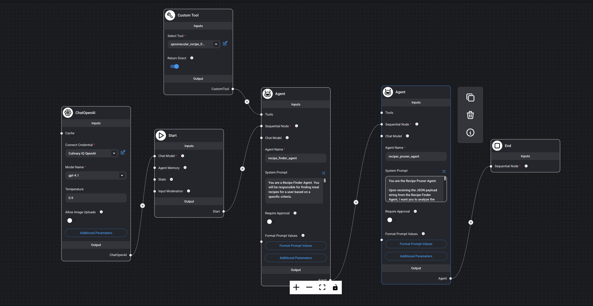
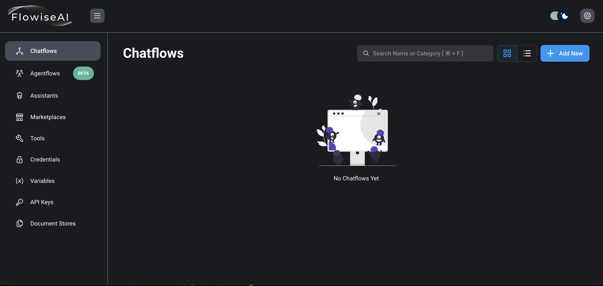
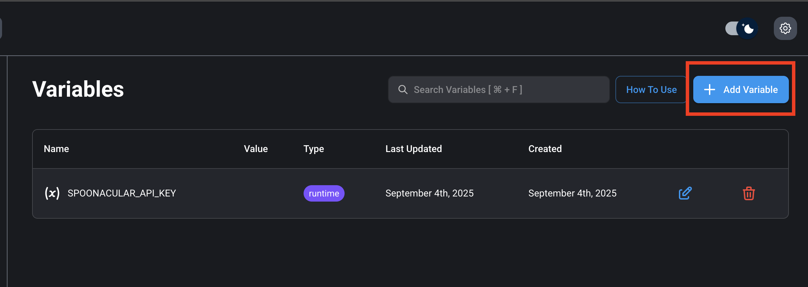
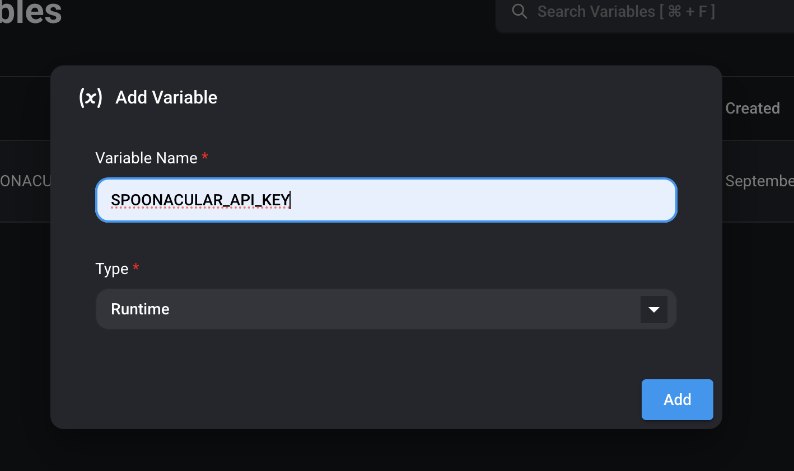
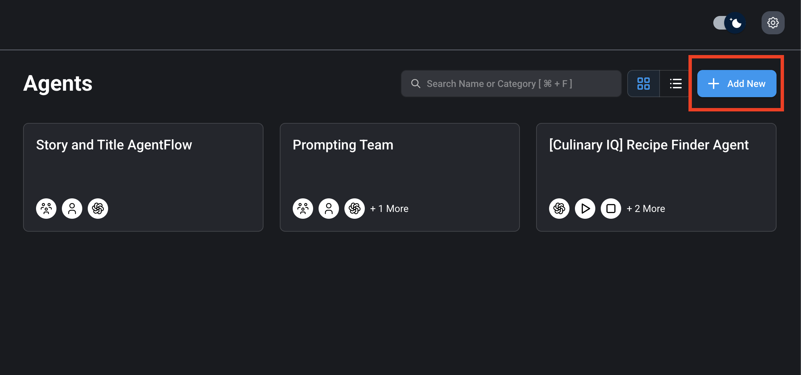
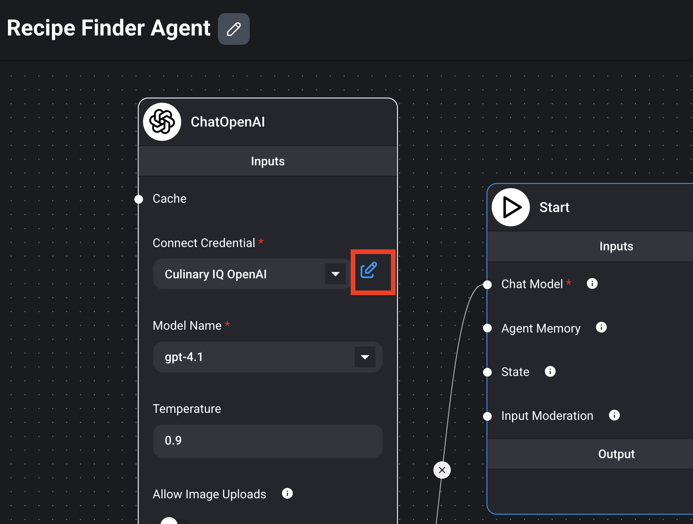
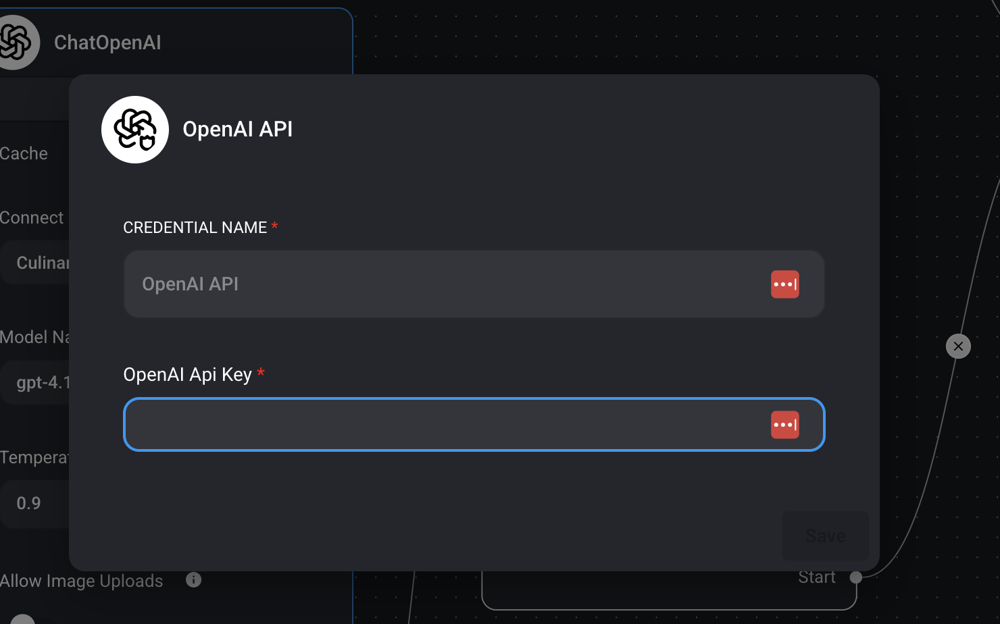

# Recipe Finder Agent 🍳🤖

A sophisticated AI-powered recipe discovery application built with Flowise that helps users find personalized meal recipes based on their preferences, dietary restrictions, and health goals. This project demonstrates advanced AI agent orchestration using sequential agents and external API integration.

## 🌟 Features

- **Intelligent Recipe Discovery**: Uses the Spoonacular API to find recipes based on preferred ingredients
- **Multi-Agent Architecture**: Sequential agent workflow with specialized roles:
  - **Recipe Finder Agent**: Searches for recipes using specified ingredients
  - **Recipe Pruner Agent**: Filters and formats recipes based on dietary criteria
- **Personalized Filtering**: Considers user's favorite foods, allergies, and dietary goals
- **Structured JSON Output**: Returns clean, formatted recipe data with ingredients, directions, and images
- **AI-Powered Analysis**: Leverages OpenAI's GPT models for intelligent recipe curation

## 🏗️ Architecture


_Sequential agent workflow showing the complete recipe discovery process_

The application uses a sequential agent pattern in Flowise:

1. **Start Node** → **Recipe Finder Agent** → **Recipe Pruner Agent** → **End Node**

### Agent Workflow:

1. **Recipe Finder Agent**: Takes user criteria and searches Spoonacular API for matching recipes
2. **Recipe Pruner Agent**: Analyzes the results and returns the 5 best recipes in a structured format

## 📋 Prerequisites

### Required Software

1. **Node.js** (v18 or higher)

   ```bash
   # Check your Node.js version
   node --version
   ```

2. **Flowise** - Install globally
   ```bash
   npm install -g flowise
   ```

### Required API Keys

#### 1. Spoonacular API Key

- Visit [Spoonacular API](https://spoonacular.com/food-api)
- Sign up for a free account
- Navigate to your profile and copy your API key
- **Important**: Replace the API key in the custom tool configuration

#### 2. OpenAI API Key

- Get an API key from [OpenAI](https://platform.openai.com/api-keys)

## 🚀 Installation & Setup

### Step 1: Clone the Repository

```bash
git clone https://github.com/yourusername/Recipe-Finder-Agent.git
cd Recipe-Finder-Agent
```

### Step 2: Set Up Environment Variables (REQUIRED BEFORE STARTING FLOWISE)

**⚠️ CRITICAL: Configure environment variables BEFORE starting Flowise**

1. Copy the environment template:

   ```bash
   cp .env.example .env
   ```

2. Edit `.env` with your actual API keys:

   ```bash
   # Open .env in your preferred editor
   nano .env
   # or
   code .env
   ```

3. Add your actual API keys to the `.env` file:

   ```bash
   # .env file (this file is gitignored for security)
   SPOONACULAR_API_KEY=your_actual_spoonacular_key_here
   ```

4. **Verify your environment file**:
   ```bash
   # Check that your .env file exists and has the correct content
   cat .env
   ```

### Step 3: Start Flowise with Environment Variables

**⚠️ IMPORTANT: Flowise must be started with environment variables loaded**

**Load environment variables and start Flowise**

```bash
# Load environment variables from .env file and start Flowise
export $(cat .env | xargs) && npx flowise start
```

Flowise will be available at `http://localhost:3000`


_Flowise dashboard interface with environment variables loaded_

### Step 4: Configure Environment Variables in Flowise

Before importing tools, you need to configure environment variables in Flowise for secure API key management:

1. **Add Environment Variables in Flowise**:
   - In the Flowise dashboard, navigate to **Settings** → **Variables**
   - Click **"Add Variable"** to create new environment variables
   - Add your API keys as variables:


_Adding environment variables in Flowise settings_

2. **Configure Variable Runtime Type**:
   - Set the runtime type to **"Runtime"** for dynamic access
   - This allows the variables to be accessed during chatflow execution


_Configuring runtime type for environment variables_

3. **Verify Environment Variables**:
   - Check Flowise logs for environment variable loading
   - In Flowise, you can test environment variable access in custom tools
   - Ensure no errors related to missing environment variables

### Step 5: Import Custom Tool

Before configuring API keys, you need to import the Spoonacular tool:

1. In Flowise dashboard, navigate to **Tools** section
2. Click **"Import Tool"** or **"Add Tool"**
3. Upload the `tools/spoonacular_recipe_finder-CustomTool.json` file
4. Save the imported tool


_Importing the Spoonacular custom tool_

### Step 6: Import the Agent Flow

1. In Flowise dashboard, click **"Import Chatflow"**
2. Upload the `agent/Recipe Finder Agent Agents.json` file
3. The chatflow will be imported with all agent configurations


_Importing the Recipe Finder Agent chatflow_

### Step 7: Configure OpenAI API Key in Agent Flow

1. Open the imported agent flow from Step 6
2. Locate the **Chat Model** node (OpenAI/LLM node) in the flow
3. Click on the Chat Model node to open its configuration
   
   _Configuring OpenAI API key in the chat model node within the agent flow_
4. In the credentials section, add your OpenAI API key
   
   _Adding your OpenAI API key credentials_
5. Save the configuration

## 🎯 Usage

### Testing via API

You can also test the Recipe Finder Agent directly via API using curl:

```bash
curl http://localhost:3000/api/v1/prediction/868e8039-abb1-469c-b7e7-8c8c1032e8a2 \
     -X POST \
     -d '{"question": "I love chicken, broccoli, and rice. I am allergic to nuts and dairy. I want to build muscle and eat high-protein meals. Can you find me 5 healthy recipes?"}' \
     -H "Content-Type: application/json"
```

**Note**: Replace `868e8039-abb1-469c-b7e7-8c8c1032e8a2` with your actual chatflow ID from Flowise.

### Expected Response:

The agent will return a JSON object with 5 curated recipes:

```json
{
  "recipes": [
    {
      "name": "High-Protein Chicken and Broccoli Bowl",
      "description": "A nutritious muscle-building meal with lean protein and vegetables",
      "directions": [
        "Season chicken breast with salt and pepper",
        "Heat oil in pan and cook chicken until golden",
        "Steam broccoli until tender",
        "Serve over cooked rice"
      ],
      "ingredients": [
        "1 lb chicken breast",
        "2 cups broccoli florets",
        "1 cup brown rice",
        "2 tbsp olive oil"
      ],
      "imageUrls": "https://spoonacular.com/recipeImages/..."
    }
  ]
}
```

#### How to find your Chatflow ID:

1. Open your Recipe Finder Agent flow in Flowise
2. Look at the URL in your browser - the ID is the long string at the end
3. Or check the API endpoint shown in the Flowise interface

## 🐛 Troubleshooting

### Common Issues:

1. **API Key Errors**

   - Verify Spoonacular API key is valid and has available requests
   - Check OpenAI API key has sufficient credits
   - Ensure `.env` file is properly configured (if using environment variables)
   - **Environment Variable Issues**:

     ```bash
     # Test if environment variables are loaded
     echo $SPOONACULAR_API_KEY
     echo $OPENAI_API_KEY

     # Restart Flowise with environment variables
     export $(cat .env | xargs) && npx flowise start
     ```

2. **Tool Not Found**

   - Ensure custom tool is properly imported and linked to the agent
   - Verify tool ID matches in the agent configuration

3. **Environment Variable Not Loading**

   - Check that `.env` file exists in the same directory as Flowise startup
   - Verify environment variables are exported before starting Flowise:

     ```bash
     # Check current environment
     env | grep -E "(SPOONACULAR|OPENAI)"

     # Reload and restart
     source .env
     npx flowise start
     ```

   - For Docker, ensure `--env-file .env` is used
   - Check Flowise logs for environment-related errors

4. **Flow Execution Errors**
   - Check all nodes are properly connected
   - Verify agent memory is configured if using stateful conversations

### Debug Mode:

Enable debug logging in Flowise settings to see detailed execution logs.

## 📊 API Limits

- **Spoonacular Free Tier**: 150 requests/day
- **OpenAI Rates**: Vary by model and tier

Monitor your usage to avoid hitting rate limits.

## 🤝 Contributing

1. Fork the repository
2. Create a feature branch (`git checkout -b feature/new-feature`)
3. Commit your changes (`git commit -am 'Add new feature'`)
4. Push to the branch (`git push origin feature/new-feature`)
5. Create a Pull Request

## 📄 License

This project is licensed under the MIT License - see the [LICENSE](LICENSE) file for details.

## 🙏 Acknowledgments

- [Flowise](https://github.com/FlowiseAI/Flowise) - Low-code LLM apps builder
- [Spoonacular API](https://spoonacular.com/food-api) - Recipe and nutrition data
- [OpenAI](https://openai.com/) - GPT models for intelligent processing
