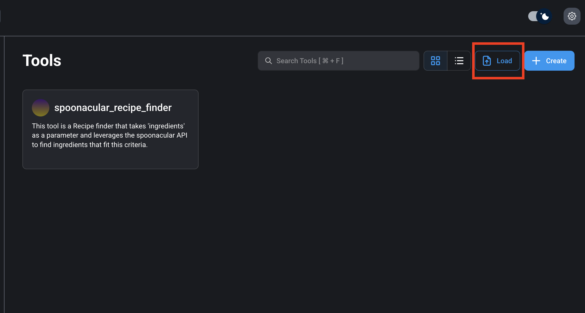

# Recipe Finder Agent 🍳🤖

A sophisticated AI-powered recipe discovery application built with Flowise that helps users find personalized meal recipes based on their preferences, dietary restrictions, and health goals. This project demonstrates advanced AI agent orchestration using sequential agents and external API integration.

## 🌟 Features

- **Intelligent Recipe Discovery**: Uses the Spoonacular API to find recipes based on preferred ingredients
- **Multi-Agent Architecture**: Sequential agent workflow with specialized roles:
  - **Recipe Finder Agent**: Searches for recipes using specified ingredients
  - **Recipe Pruner Agent**: Filters and formats recipes based on dietary criteria
- **Personalized Filtering**: Considers user's favorite foods, allergies, and dietary goals
- **Structured JSON Output**: Returns clean, formatted recipe data with ingredients, directions, and images
- **AI-Powered Analysis**: Leverages OpenAI's GPT models for intelligent recipe curation

## 🏗️ Architecture


_Sequential agent workflow showing the complete recipe discovery process_

The application uses a sequential agent pattern in Flowise:

1. **Start Node** → **Recipe Finder Agent** → **Recipe Pruner Agent** → **End Node**

### Agent Workflow:

1. **Recipe Finder Agent**: Takes user criteria and searches Spoonacular API for matching recipes
2. **Recipe Pruner Agent**: Analyzes the results and returns the 5 best recipes in a structured format

## 📋 Prerequisites

### Required Software

1. **Node.js** (v18 or higher)

   ```bash
   # Check your Node.js version
   node --version
   ```

2. **Flowise** - Install globally
   ```bash
   npm install -g flowise
   ```
   Or using Docker:
   ```bash
   docker pull flowiseai/flowise
   ```

### Required API Keys

#### 1. Spoonacular API Key

- Visit [Spoonacular API](https://spoonacular.com/food-api)
- Sign up for a free account
- Navigate to your profile and copy your API key
- **Important**: Replace the API key in the custom tool configuration

#### 2. OpenAI API Key (or Alternative LLM)

- Get an API key from [OpenAI](https://platform.openai.com/api-keys)
- Alternative LLM options:
  - **Anthropic Claude**: [Get API key](https://console.anthropic.com/)
  - **Google Gemini**: [Get API key](https://ai.google.dev/)
  - **Local LLMs**: Ollama, LM Studio, or similar
  - **Azure OpenAI**: Enterprise option

## 🚀 Installation & Setup

### Step 1: Clone the Repository

```bash
git clone https://github.com/yourusername/Recipe-Finder-Agent.git
cd Recipe-Finder-Agent
```

### Step 2: Set Up Environment Variables (REQUIRED BEFORE STARTING FLOWISE)

**⚠️ CRITICAL: Configure environment variables BEFORE starting Flowise**

1. Copy the environment template:

   ```bash
   cp .env.example .env
   ```

2. Edit `.env` with your actual API keys:

   ```bash
   # Open .env in your preferred editor
   nano .env
   # or
   code .env
   ```

3. Add your actual API keys to the `.env` file:

   ```bash
   # .env file (this file is gitignored for security)
   SPOONACULAR_API_KEY=your_actual_spoonacular_key_here
   OPENAI_API_KEY=your_actual_openai_key_here
   ```

4. **Verify your environment file**:
   ```bash
   # Check that your .env file exists and has the correct content
   cat .env
   ```


_Setting up secure environment variables_

### Step 3: Start Flowise with Environment Variables

**⚠️ IMPORTANT: Flowise must be started with environment variables loaded**

**Method A: Load environment variables and start Flowise (Recommended)**

```bash
# Load environment variables from .env file and start Flowise
export $(cat .env | xargs) && npx flowise start

# Verify variables are loaded before starting
echo "Spoonacular API Key: $SPOONACULAR_API_KEY"
echo "OpenAI API Key: $OPENAI_API_KEY"
npx flowise start
```

**Method B: Using Docker with environment file**

```bash
# Using Docker with environment file (Recommended for Docker users)
docker run -d \
  --name flowise \
  -p 3000:3000 \
  --env-file .env \
  flowiseai/flowise

# Or with individual environment variables
docker run -d \
  --name flowise \
  -p 3000:3000 \
  -e SPOONACULAR_API_KEY="$(grep SPOONACULAR_API_KEY .env | cut -d '=' -f2)" \
  -e OPENAI_API_KEY="$(grep OPENAI_API_KEY .env | cut -d '=' -f2)" \
  flowiseai/flowise
```

**Method C: Manual export (Alternative)**

```bash
# Export variables manually
export SPOONACULAR_API_KEY=your_actual_spoonacular_key_here
export OPENAI_API_KEY=your_actual_openai_key_here

# Then start Flowise
npx flowise start
```

Flowise will be available at `http://localhost:3000`


_Flowise dashboard interface with environment variables loaded_

### Step 4: Verify Environment Variables in Flowise

Before importing tools, verify that Flowise can access your environment variables:

1. Check Flowise logs for environment variable loading
2. In Flowise, you can test environment variable access in custom tools
3. Ensure no errors related to missing environment variables

### Step 5: Import Custom Tool

Before configuring API keys, you need to import the Spoonacular tool:

1. In Flowise dashboard, navigate to **Tools** section
2. Click **"Import Tool"** or **"Add Tool"**
3. Upload the `tools/spoonacular_recipe_finder-CustomTool.json` file
4. Save the imported tool


_Importing the Spoonacular custom tool_

### Step 5: Configure API Keys in Tools

#### Configure Spoonacular API Key:

**Option A: Using Environment Variables (Recommended - if Flowise supports process.env)**

1. After importing the tool, edit the **spoonacular_recipe_finder** tool
2. In the **Function** section, update to use environment variables:

   ```javascript
   const fetch = require("node-fetch");

   async function fetchRecipe() {
     // Try to get API key from environment variable first
     const apiKey =
       process.env.SPOONACULAR_API_KEY || "YOUR_SPOONACULAR_API_KEY_HERE";

     if (!apiKey || apiKey === "YOUR_SPOONACULAR_API_KEY_HERE") {
       throw new Error(
         "SPOONACULAR_API_KEY environment variable not set. Please configure your API key."
       );
     }

     const url = `https://api.spoonacular.com/recipes/findByIngredients?apiKey=${apiKey}&number=20&ingredients=${$ingredients}`;

     try {
       const response = await fetch(url);
       const data = await response.json();

       console.log("Recipe:", data[0]);
       return JSON.stringify(data);
     } catch (error) {
       return "Error fetching recipe: " + error;
     }
   }

   return fetchRecipe();
   ```

3. Save the tool configuration

**Option B: Direct Configuration (If environment variables don't work in Flowise)**

1. Replace the API key directly in the function:
   ```javascript
   const apiKey = "your_actual_spoonacular_key_here";
   ```
2. **⚠️ Security Risk**: Remember to remove the key before committing to version control

**Option C: Flowise Credentials (Most Secure for Production)**

1. Use Flowise's built-in credential management system
2. Create a credential in Flowise settings
3. Reference the credential in your tool function


_Configuring the Spoonacular API key in the custom tool_

#### Configure OpenAI Credentials in Flowise:

1. Navigate to Flowise dashboard (`http://localhost:3000`)
2. Go to **Settings** → **Credentials**
3. Add new credential with type **OpenAI API**
4. Enter your OpenAI API key


_Adding OpenAI credentials in Flowise_

### Step 7: Import the Agent Flow

1. In Flowise dashboard, click **"Import Chatflow"**
2. Upload the `agent/Recipe Finder Agent Agents.json` file
3. The chatflow will be imported with all agent configurations


_Importing the Recipe Finder Agent chatflow_

### Step 8: Link the Custom Tool

1. Open the imported chatflow
2. Ensure the **Custom Tool** node is linked to the **Recipe Finder Agent**
3. In the Custom Tool node, select the imported **spoonacular_recipe_finder** tool
4. Verify all connections between nodes are intact


_Linking the Spoonacular tool to the Recipe Finder Agent_


_Complete agent flow with all nodes connected_

## 🎯 Usage


_Example conversation with the Recipe Finder Agent_

### Example Query Format:

```
I love chicken, broccoli, and rice. I'm allergic to nuts and dairy.
I want to build muscle and eat high-protein meals.
```

### Expected Response:

The agent will return a JSON object with 5 curated recipes:

```json
{
  "recipes": [
    {
      "name": "High-Protein Chicken and Broccoli Bowl",
      "description": "A nutritious muscle-building meal with lean protein and vegetables",
      "directions": [
        "Season chicken breast with salt and pepper",
        "Heat oil in pan and cook chicken until golden",
        "Steam broccoli until tender",
        "Serve over cooked rice"
      ],
      "ingredients": [
        "1 lb chicken breast",
        "2 cups broccoli florets",
        "1 cup brown rice",
        "2 tbsp olive oil"
      ],
      "imageUrls": "https://spoonacular.com/recipeImages/..."
    }
  ]
}
```

## 🔧 Configuration


_Configuring agent system prompts and parameters_

### Customizing the Agents

#### Recipe Finder Agent System Prompt:

Located in the agent configuration, you can modify the search criteria and behavior.

#### Recipe Pruner Agent System Prompt:

Customize the filtering logic and output format requirements.

### Tool Parameters

The Spoonacular tool accepts:

- **ingredients**: Comma-separated list of ingredients (e.g., "chicken, broccoli, garlic")

## 🔐 Security Best Practices

- **Never commit API keys** to version control
- Use environment variables or Flowise credentials for production
- Regularly rotate your API keys
- Monitor API usage for unauthorized access
- See [SECURITY.md](SECURITY.md) for detailed guidelines

## 🐛 Troubleshooting


_Flowise debug interface showing execution logs_

### Common Issues:

1. **API Key Errors**

   - Verify Spoonacular API key is valid and has available requests
   - Check OpenAI API key has sufficient credits
   - Ensure `.env` file is properly configured (if using environment variables)
   - **Environment Variable Issues**:

     ```bash
     # Test if environment variables are loaded
     echo $SPOONACULAR_API_KEY
     echo $OPENAI_API_KEY

     # Restart Flowise with environment variables
     export $(cat .env | xargs) && npx flowise start
     ```

2. **Tool Not Found**

   - Ensure custom tool is properly imported and linked to the agent
   - Verify tool ID matches in the agent configuration

3. **Environment Variable Not Loading**

   - Check that `.env` file exists in the same directory as Flowise startup
   - Verify environment variables are exported before starting Flowise:

     ```bash
     # Check current environment
     env | grep -E "(SPOONACULAR|OPENAI)"

     # Reload and restart
     source .env
     npx flowise start
     ```

   - For Docker, ensure `--env-file .env` is used
   - Check Flowise logs for environment-related errors

4. **Flow Execution Errors**
   - Check all nodes are properly connected
   - Verify agent memory is configured if using stateful conversations

### Debug Mode:

Enable debug logging in Flowise settings to see detailed execution logs.

## 📊 API Limits

- **Spoonacular Free Tier**: 150 requests/day
- **OpenAI Rates**: Vary by model and tier

Monitor your usage to avoid hitting rate limits.

## 🤝 Contributing

1. Fork the repository
2. Create a feature branch (`git checkout -b feature/new-feature`)
3. Commit your changes (`git commit -am 'Add new feature'`)
4. Push to the branch (`git push origin feature/new-feature`)
5. Create a Pull Request

## 📄 License

This project is licensed under the MIT License - see the [LICENSE](LICENSE) file for details.

## 🙏 Acknowledgments

- [Flowise](https://github.com/FlowiseAI/Flowise) - Low-code LLM apps builder
- [Spoonacular API](https://spoonacular.com/food-api) - Recipe and nutrition data
- [OpenAI](https://openai.com/) - GPT models for intelligent processing

---

**Made with ❤️ to showcase AI proficiency and agent orchestration capabilities**
